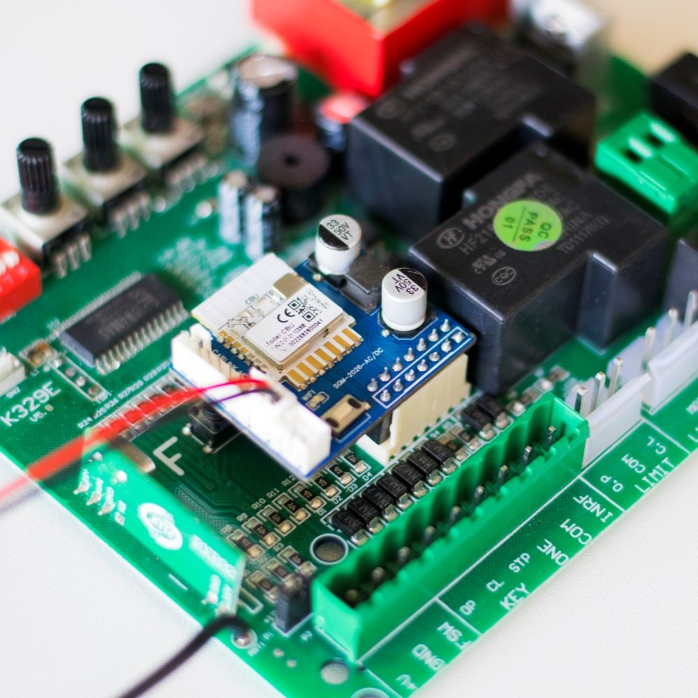
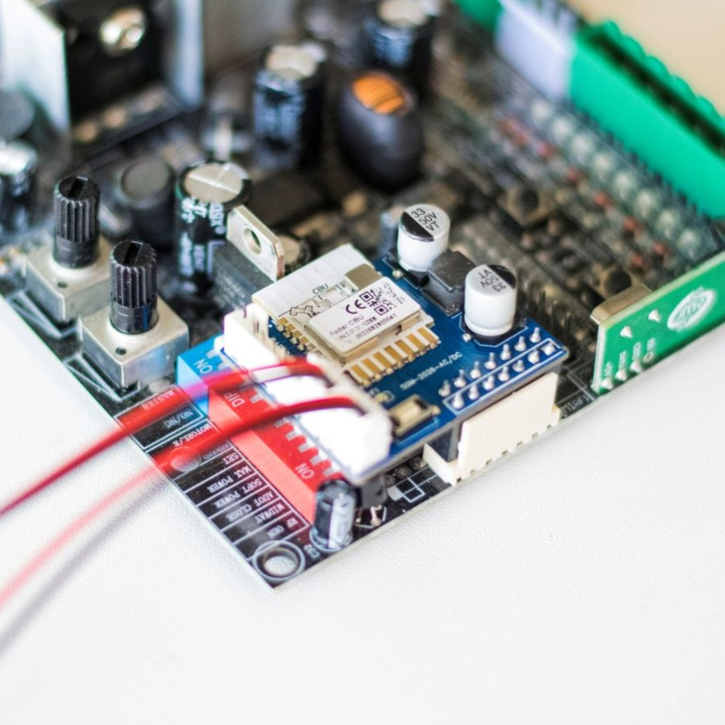
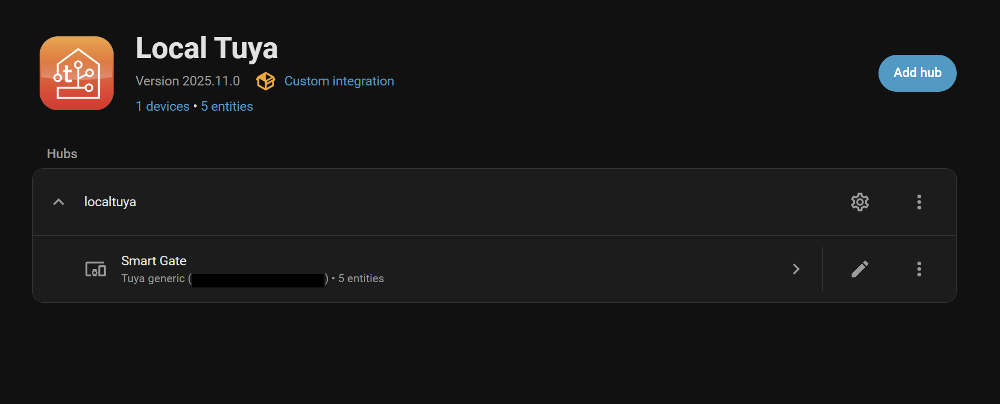
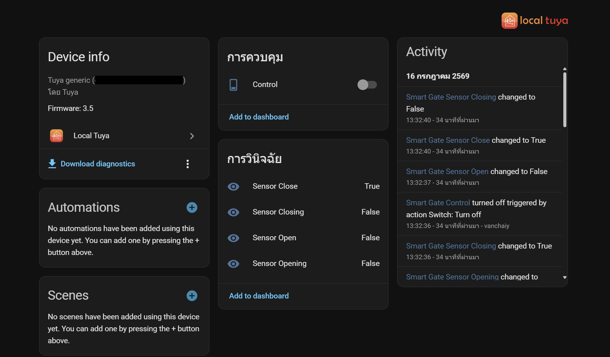
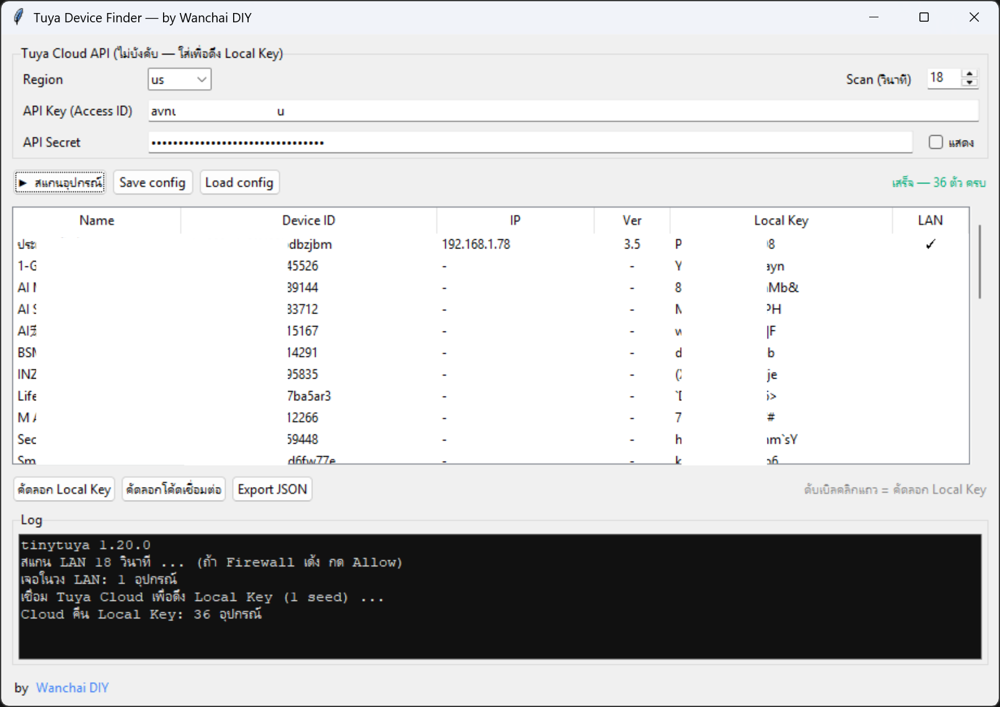
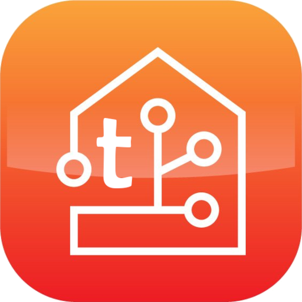

[](https://www.home-assistant.io/)
[]()

# Smart Gate Module — คู่มือเชื่อมต่อ Home Assistant ผ่าน LocalTuya
คู่มือการเชื่อมต่อ **Smart Gate Module (SGM-2026-AC/DC)** ซึ่งเป็นอุปกรณ์ Tuya
ที่ใช้ **custom DP** ทั้งหมด เข้ากับ **Home Assistant** ผ่าน integration
[`xZetsubou/hass-localtuya`](https://github.com/xZetsubou/hass-localtuya)

| รายการ | ค่า |
| --- | --- |
| Product ID | `tkmkc5k7gqklhh5o` |
| Model | `SGM-2026-AC/DC` |
| Protocol version | **3.5** |
| Integration | `xZetsubou/hass-localtuya` (fork ของ rospogrigio/localtuya) |

---

|  |  |
|--------------------------|--------------------------|

|  |  |
|--------------------------|--------------------------|

---

## 1. ทำไมต่อผ่าน Tuya integration ทางการไม่ได้

Tuya integration ตัวทางการ (cloud) ของ Home Assistant จะ map อุปกรณ์เป็น entity
ตาม **category + รหัส DP มาตรฐาน** เท่านั้น อุปกรณ์นี้สร้าง DP เองทั้งหมด
(custom function points, DP 101–141) ซึ่งไม่ตรงกับ schema มาตรฐานที่ integration รู้จัก
อุปกรณ์จึงขึ้นสถานะ **"unsupported"** และไม่มี entity โผล่ออกมา

ทางแก้คือควบคุมแบบ local โดยตรงผ่าน **LocalTuya** ซึ่ง map DP ทีละตัวเองได้
โดยไม่สนใจ category

> **หมายเหตุ:** ต้องใช้ fork `xZetsubou/hass-localtuya` เพราะอุปกรณ์นี้เป็น
> **protocol 3.5** ซึ่ง LocalTuya ตัวดั้งเดิม (rospogrigio) รุ่นเก่ายังรองรับแค่ถึง 3.4

---

## 2. สิ่งที่ต้องเตรียม

- Home Assistant + [HACS](https://hacs.xyz/) ติดตั้งเรียบร้อย
- อุปกรณ์และ Home Assistant อยู่ใน **วง LAN / subnet เดียวกัน**
- ข้อมูล 3 อย่างของอุปกรณ์:
  - **Device ID**
  - **IP address** (แนะนำจอง static DHCP reservation กัน IP เปลี่ยน)
  - **Local Key**

---

## 3. หา Device ID / IP / Local Key

##  วิธีที่ 1 — ใช้ Tuya Device Finder  (แนะนำ)

โปรเจกต์นี้ต้องใช้ **Device ID + IP + Local Key** ของอุปกรณ์ Tuya
ใช้โปรแกรม **Tuya Device Finder** ช่วยหาได้เลย — มีทั้งแบบ GUI (Windows) และ CLI (ทุกแพลตฟอร์ม)



👉 **[Tuya Device Finder](https://github.com/vanchaiy/Tuya-Device-Finder)**

---


### วิธีที่ 2 — tinytuya

ติดตั้ง / อัปเดต tinytuya ให้เป็นรุ่นใหม่ (ต้อง ≥ 1.15 เพื่อรองรับ protocol 3.5):

```bash
python -m pip install --upgrade tinytuya
python -c "import tinytuya; print(tinytuya.__version__)"   # ควรได้ 1.20.x ขึ้นไป
```

ดึง Local Key จาก Tuya IoT Platform ด้วย wizard (จะสร้าง `devices.json` ให้):

```bash
python -m tinytuya wizard
```

สแกนหาอุปกรณ์ในวง LAN (จะได้ IP + protocol version):

```bash
python -m tinytuya scan
```

### วิธีที่ 3 — Tuya IoT Platform

เข้า [iot.tuya.com](https://iot.tuya.com) → Cloud → เลือก device → ดู Device ID
และ Local Key ในหน้า Device Details

> ⚠️ **Local Key จะเปลี่ยนทุกครั้งที่ re-pair อุปกรณ์เข้าแอปใหม่**
> ถ้า reset / flash firmware แล้วจับคู่ใหม่ ต้องดึง key ใหม่เสมอ

---


## 4. ติดตั้ง xZetsubou/hass-localtuya



1. เปิด **HACS** → เมนู `⋮` (มุมขวาบน) → **Custom repositories**
2. ใส่ URL: `https://github.com/xZetsubou/hass-localtuya`
3. เลือก Category: **Integration** → กด **Add**
4. ค้นหา **LocalTuya** ในรายการ → **Download** → เลือกเวอร์ชันล่าสุด
5. **Restart Home Assistant**

> ถ้าเคยติดตั้ง LocalTuya ตัวเดิม (rospogrigio) อยู่แล้ว แนะนำลบออกก่อนกันชนกัน

---

## 5. เพิ่มอุปกรณ์และตั้งค่า

Settings → Devices & Services → **Add Integration** → **LocalTuya** → **Add Device**

กรอกข้อมูล:

| ช่อง | ค่า |
| --- | --- |
| **Name** | ตั้งชื่อได้ตามใจ เช่น `Smart Gate` |
| **Host** | IP ของอุปกรณ์ เช่น `192.168.1.xx` |
| **Device ID** | Device ID ที่ได้จากขั้นตอน 3 |
| **Local key** | Local Key ที่ได้จากขั้นตอน 3 |
| **Protocol Version** | **3.5** ← สำคัญที่สุด |

> เลือก protocol version ผิดคือสาเหตุอันดับหนึ่งของอาการ "เพิ่มอุปกรณ์ได้ แต่สั่งงานไม่ได้"
> อุปกรณ์นี้ **ต้องเป็น 3.5 เท่านั้น**

---

## 6. ตาราง Data Point (DP) ทั้งหมด

`Send Only` = สั่งได้อย่างเดียว ไม่ report สถานะ (จะไม่โผล่ใน auto-detect ต้องพิมพ์ id เอง)
`Report Only` = อ่านสถานะได้อย่างเดียว · `Send and Report` = อ่าน/เขียนได้ทั้งคู่

| DP | ชื่อ | Identifier | ทิศทาง | Type | ค่า / ช่วง |
| --- | --- | --- | --- | --- | --- |
| **101** | Button Open | `button_open` | Send Only | bool | — |
| **102** | Button Close | `button_close` | Send Only | bool | — |
| **103** | Button Stop | `button_stop` | Send Only | bool | — |
| 104 | Partially Open | `button_open_partially` | Send Only | bool | — |
| 105 | Voice Control | `voice_control` | Send and Report | bool | — |
| 106 | Sensor Open | `sensor_open` | Report Only | bool | — |
| 107 | Sensor Close | `sensor_close` | Report Only | bool | — |
| 108 | Sensor Opening | `sensor_opening` | Report Only | bool | — |
| 109 | Sensor Closing | `sensor_closing` | Report Only | bool | — |
| 110 | Door Direction | `direction` | Send and Report | enum | `left`, `right` |
| 111 | Stop Before Close | `stop_before_close` | Send and Report | bool | — |
| 112 | Door Movement | `door_movement` | Send and Report | value | 0–86400 s |
| 113 | Partially Open | `partially_open` | Send and Report | value | 0–86400 s |
| 114 | Door Left Open Alert | `door_left_open_alert` | Send and Report | value | 0–86400 s |
| 115 | Auto Close | `auto_close` | Send and Report | value | 0–86400 s |
| 116 | USB Carlink | `usb_carlink` | Send and Report | bool | — |
| 117 | Carlink | `carlink_on` | Send and Report | bool | — |
| 118 | Carlink Add Device | `add_usb` | Send Only | bool | — |
| 119 | Carlink Remove All | `remove_all_usb` | Send Only | bool | — |
| 120 | Carlink Close Delay | `close_delay` | Send and Report | value | 0–86400 s |
| 121 | Carlink Stop Before Close | `carlink_stop_before_close` | Send and Report | bool | — |
| 122 | Carlink Repeat Close Delay | `repeat_close_delay` | Send and Report | value | 0–86400 s |
| 123 | Camera ID | `camera_id` | Send and Report | string | — |
| **124** | Status | `status` | Report Only | enum | `open`, `closed`, `timeout`, `autoclose`, `stop` |
| 125 | Model | `model` | Report Only | string | — |
| 126 | Set Button Open Click | `button_open_click` | Send and Report | enum | `open`, `close`, `hide` |
| 127 | Set Button Close Click | `button_close_click` | Send and Report | enum | `close`, `open`, `hide` |
| 128 | Set Button Stop Click | `button_stop_click` | Send and Report | enum | `stop`, `hide` |
| 129 | Set Button Partially Click | `button_partially_click` | Send and Report | enum | `use`, `hide` |
| 130 | Carlink Open | `carlink_open` | Send and Report | bool | — |
| 131 | Carlink Close | `carlink_close` | Send and Report | bool | — |
| 132 | Camera Resolution | `camera_resolution` | Send and Report | enum | `auto`, `hd`, `normal` |
| 133 | Camera PTZ Controllable | `camera_ptz` | Send and Report | bool | — |
| 134 | Permissions | `permissions` | Send and Report | bool | — |
| 135 | Door Open Alert | `door_open_alert` | Send and Report | bool | — |
| 136 | Door Closed Alert | `door_closed_alert` | Send and Report | bool | — |
| 137 | Status Alarm | `status_alert` | Report Only | enum | `open`, `close`, `timeout`, `stop`, `null` |
| 138 | Toggle Direction | `toggle_sensor_direction` | Send and Report | bool | — |
| 139 | Closing Interrupted Alert | `door_stop_alert` | Send and Report | bool | — |
| 140 | Aspect Ratio | `aspect_ratio` | Send and Report | enum | `standard`, `full` |
| 141 | Force Door Close | `force_close` | Send and Report | value | 0–60 s |

---

## 7. map 3 ปุ่มควบคุมประตู (Open / Close / Stop)

ปุ่มควบคุมหลักคือ DP **101 / 102 / 103** ทั้งหมดเป็น **bool + Send Only**

เพราะเป็น Send-Only อุปกรณ์จึงไม่ report สถานะกลับ → **DP เหล่านี้จะไม่โผล่ใน
dropdown auto-detect ของ LocalTuya** ต้องเลือก **"Add DP manually"** แล้วพิมพ์
เลข DP id เอง

### ตัวเลือก A — 3 ปุ่มแยกกัน (switch)

เพิ่ม entity 3 ตัว เลือก platform **switch** แล้วผูก DP id:

| Entity | DP id | หมายเหตุ |
| --- | --- | --- |
| Gate Open | `101` | momentary — ดูข้อควรระวังด้านล่าง |
| Gate Close | `102` | momentary |
| Gate Stop | `103` | momentary |

> **ข้อควรระวัง momentary:** ปุ่มพวกนี้เป็น trigger (กดแล้วสั่งครั้งเดียว)
> ถ้า firmware ไม่ reset ค่ากลับเป็น `false` เอง switch จะค้างสถานะ "on"
> ทำให้กดซ้ำไม่ติด แนะนำให้ firmware set DP กลับเป็น false หลังทำงานเสร็จ
> หรือใช้ HA script/automation สั่ง `turn_on` แล้ว `turn_off` อัตโนมัติ

### ตัวเลือก B — cover (แนะนำ, UI สวยกว่า)

ใช้ DP **124 (`status`)** เป็นสถานะประตู แล้วผูกคำสั่ง open/close/stop
เข้ากับ platform **cover** ของ LocalTuya จะได้การ์ดประตูที่มีปุ่ม
เปิด/หยุด/ปิด รวมในอันเดียว พร้อมแสดงสถานะจริง

> Cover ของ LocalTuya ออกแบบมาสำหรับ **command DP ตัวเดียว** (เช่น enum
> open/close/stop) แต่ประตูนี้แยกเป็น 3 DP หากต้องการใช้ cover เต็มรูปแบบ
> แนะนำ (ฝั่ง firmware) เพิ่ม DP command แบบ enum ตัวเดียว เช่น
> `control: open / close / stop` เพิ่มจาก 101/102/103 เดิม

### Entity เสริมที่น่าเพิ่ม

| Entity | Platform | DP | ประโยชน์ |
| --- | --- | --- | --- |
| Gate Status | sensor | `124` | แสดงสถานะ open/closed/timeout/... |
| Sensor Open | binary_sensor | `106` | limit switch ฝั่งเปิด |
| Sensor Close | binary_sensor | `107` | limit switch ฝั่งปิด |
| Auto Close | number | `115` | ตั้งเวลาปิดอัตโนมัติ (วินาที) |
| Door Direction | select | `110` | สลับทิศ left/right |

---

## 8. ทดสอบด้วย tinytuya (นอก Home Assistant)

สคริปต์ตรวจสอบว่าอุปกรณ์รับคำสั่งได้ ก่อนไปตั้งค่าใน HA:

```python
import tinytuya

DEVICE_ID = "your_device_id"
DEVICE_IP = "192.168.1.xx"
LOCAL_KEY = "your_local_key"

d = tinytuya.Device(DEVICE_ID, DEVICE_IP, LOCAL_KEY)
d.set_version(3.5)              # อุปกรณ์นี้เป็น 3.5
d.set_socketPersistent(True)

print("status:", d.status())   # อ่านสถานะ (DP 101-103 จะไม่โผล่ เพราะ Send-Only)
print("open:",   d.set_value(101, True))   # สั่งเปิด
# print("close:", d.set_value(102, True))  # สั่งปิด
# print("stop:",  d.set_value(103, True))  # สั่งหยุด
```

---

## 9. Troubleshooting

| อาการ | สาเหตุ | วิธีแก้ |
| --- | --- | --- |
| `socket.gaierror: getaddrinfo failed` | IP ในสคริปต์เป็น placeholder / ผิด | ใส่ IP จริง (รัน `tinytuya scan`) |
| `ord() expected a character... length 0` หรือ payload `b''` | protocol version ผิด **หรือ** tinytuya เก่าเกินไป | อัปเดต tinytuya ให้ ≥ 1.15 แล้วใช้ version 3.5 |
| `Error 914: Check device key or version` | version หรือ local key ไม่ตรง | ยืนยัน version = 3.5 และ local key ล่าสุด |
| `Error 904: Unexpected Payload` | protocol version ต่ำกว่าที่อุปกรณ์ใช้ | เปลี่ยนเป็น 3.5 |
| LocalTuya มีให้เลือกแค่ถึง 3.4 | integration เก่า ไม่รองรับ 3.5 | ใช้ fork `xZetsubou/hass-localtuya` |
| เพิ่มอุปกรณ์ได้ แต่สั่งงานไม่ได้ | protocol version ผิด (เพิ่มได้/อ่านได้ แต่ write ไม่ผ่าน) | ตั้ง protocol เป็น 3.5 |
| DP 101/102/103 ไม่โผล่ตอน map | เป็น Send-Only ไม่อยู่ใน status | เลือก "Add DP manually" พิมพ์ id เอง |
| decrypt ว่างทั้งที่ version ถูก | local key เก่า / มี local connection อื่นค้าง | ดึง key ใหม่ (`tinytuya wizard`) และปิดแอป Smart Life |

### เปิด debug log ของ LocalTuya

เพิ่มใน `configuration.yaml`:

```yaml
logger:
  default: warning
  logs:
    custom_components.localtuya: debug
    custom_components.localtuya.pytuya: debug
```

---

## หมายเหตุด้านความปลอดภัย

- **อย่า commit local key / device id จริงลง Git** — ใช้ placeholder ในเอกสาร
  และเก็บค่าจริงไว้ใน `secrets.yaml` หรือ environment variable
- LocalTuya ควบคุมผ่าน LAN โดยตรง แต่ **ไม่ได้หยุด** อุปกรณ์จากการส่งสถานะขึ้น
  Tuya cloud หากต้องการตัด cloud ต้องบล็อกที่ระดับ firewall / DNS

## Related
- [HomeAssistant Gate Control Card](https://github.com/vanchaiy/HA-Gate-Control-Card) - A custom Lovelace card for Home Assistant that provides a visually immersive
- [HA-SGM-2026 API Examples](https://github.com/vanchaiy/HA-SGM-2026-API-Examples) — HA-SGM-2026 API Examples [ REST API · WebSocket · Webhook · UART ]
- [Home Assistant](https://www.home-assistant.io/) — open source home automation
- [สั่งซื้อ Tuya Smart Gate Module V2](https://shopee.co.th/product/112616476/44556251791) — Shopee Lazada Tiktok


---
